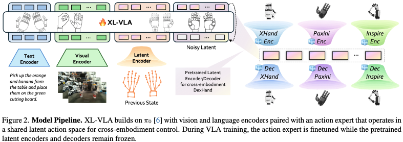

# 3 方法
## 3.1 前置知识与问题建模
### 问题定义
本文研究基于视觉感知、语言指令引导的跨灵巧手灵巧操作问题。
设灵巧手集合为 $\mathcal{H}$，对任意一款灵巧手 $h \in \mathcal{H}$，其驱动关节总数为 $d_h$，控制量为绝对关节转角 $\boldsymbol{q}^{(h)} \in \mathbb{R}^{d_h}$。

策略层面采用**动作块（action chunk）** 机制：单段动作 $\boldsymbol{q}_t^{(h)} \in \mathbb{R}^{64 \times d_h}$ 包含连续64帧关节位置指令，采样频率20Hz，对应3.2秒完整运动序列。
在第 $t$ 个控制步，策略输入包含：历史关节状态序列、上一段执行动作块 $\boldsymbol{q}_t^{(h)}$、当前视觉图像观测 $\boldsymbol{V}$、语言指令文本 $\boldsymbol{T}$；策略通过映射函数 $F$ 预测下一段动作块：
$$
\boldsymbol{q}_{t+1}^{(h)} = F(\boldsymbol{q}_t^{(h)}, \boldsymbol{V}, \boldsymbol{T})
$$

整体优化目标：基于多模态输入，通过统一多任务视觉-语言-动作（VLA）模型，预测适配不同灵巧手结构、具备一致性的关节转角轨迹。

虽然各灵巧手的连续关节空间 $\boldsymbol{q}^{(h)}$ 是设备专属的，但序列模型 $F$ 本身与灵巧手类型无关；灵巧手标识 $h$ 仅用于选择对应的编码器/解码器，完成设备关节空间与下文所述共享隐动作空间之间的映射。

为验证该方案有效性，本文选用多款结构、驱动方式、运动学构型差异显著的灵巧手开展实验：Ability Hand、Inspire Hand、X-Hand1、Paxini DexH13。

为解决上述问题，本文提出**设备无关隐动作空间**，可无缝嵌入视觉-语言-动作（VLA）框架。该隐空间为所有异构灵巧手提供统一表征，让模型能够利用跨设备数据有效训练，并将操作技能泛化至未见过的手部构型。同时，该隐空间支持控制策略在不同灵巧手之间直接迁移，无需针对单款手部重新训练。

### 整体流程

如图2所示，本文框架包含两大核心模块：
1. VLA主干网络：对视觉输入 $\boldsymbol{V}$、语言指令 $\boldsymbol{T}$ 两类多模态信息编码；
2. 预训练跨设备迁移专用隐编码器、解码器组。

本文VLA主干结构参考 $\pi_0$ 模型[6]，由视觉编码器、语言编码器与动作专家模块组成。
原版 $\pi_0$ 通过堆叠状态token输入本体感知历史；而XL-VLA改为输入**隐动作token**：
对任意灵巧手 $h$，专属编码器 $E_h$ 将上一段绝对关节位置动作块 $\boldsymbol{q}_t^{(h)}$（20Hz，共64帧）压缩为低维隐向量 $\boldsymbol{z}_t = E_h(\boldsymbol{q}_t^{(h)})$。
VLA模型以一段历史隐向量序列、视觉token、语言token作为条件输入，预测下一阶段隐动作块 $\hat{\boldsymbol{z}}_{t+1}$；再通过对应灵巧手专属解码器 $D_h$ 还原出关节指令块：
$$
\hat{\boldsymbol{q}}_{t+1}^{(h)} = D_h(\hat{\boldsymbol{z}}_{t+1})
$$
在VLA微调阶段，所有隐编码器、解码器参数固定不更新。

设备无关隐表征 $\boldsymbol{z}$ 作为异构灵巧手共享的统一动作空间。模型在该隐空间完成动作编码与解码，抹平不同灵巧手在外形、驱动结构上的差异，实现单一与设备无关的VLA策略适配多款机械灵巧手。
灵巧手标识 $h$ 仅用于匹配对应的编码器 $E_h$ 与解码器 $D_h$，不会作为显式token输入VLA主干网络。
下文详细介绍该隐动作空间的结构设计与训练方案。

## 3.2 隐动作空间
### 定义
本文不为每款灵巧手单独设计独立动作空间，而是构建一套共享隐动作空间，统一表征全部灵巧手设备。
该隐空间独立于VLA模型预先训练：所有灵巧手专属编码器、解码器均映射至同一隐分布。
由此得到的隐嵌入向量构成隐式、与设备无关的通用动作空间，下游控制策略可依托该空间无缝操控各类灵巧手。

### 3.2.1 模型建模
采用多头变分自编码器（VAE）结构搭建隐表征模块。
对每一类灵巧手 $h \in \mathcal{H}$（X-Hand、Ability、Inspire、Paxini等），分别配置专属编码器 $E_h$ 与解码器 $D_h$。
灵巧手 $h$ 的关节构型为 $\boldsymbol{q}^{(h)} \in \mathbb{R}^{d_h}$，$\boldsymbol{q}^{(h)}$ 代表关节位置，$d_h$ 为该手部关节维度。

编码器输出高斯后验分布参数 $(\boldsymbol{\mu}^{(h)},\boldsymbol{\sigma}^{(h)}) = E_h(\boldsymbol{q}^{(h)})$，通过重参数化技巧采样得到隐编码 $\boldsymbol{z}$，分布满足：
$$
q(\boldsymbol{z} \mid \boldsymbol{q}^{(h)}) = \mathcal{N}\big(\boldsymbol{\mu}^{(h)},\mathrm{diag}((\boldsymbol{\sigma}^{(h)})^2)\big)
$$
解码器则从隐向量还原对应手部原始关节空间：$\hat{\boldsymbol{q}}^{(h)} = D_h(\boldsymbol{z})$。

工程实现上，编码器、解码器均采用轻量化多层感知机（MLP）：
输入关节位置向量 $\boldsymbol{q}^{(h)}$ 经由编码器MLP投影至公共隐空间；解码器MLP再将隐嵌入映射回该灵巧手原始关节构型。
该结构既能形成统一隐流形，又能保留每款手部自身的运动结构特征。

为构建具备跨设备一致性的有效隐空间，训练时施加三项约束损失：
1. 重构损失 $\mathcal{L}_1$：保证解码关节 $\hat{\boldsymbol{q}}^{(h)}$ 与原始输入 $\boldsymbol{q}^{(h)}$ 尽可能一致；
2. 重定向损失 $\mathcal{L}_2$：借助可微正运动学，对齐不同手部指尖几何结构；
3. 隐空间正则损失 $\mathcal{L}_3$：约束隐嵌入服从平滑先验分布。

三类损失共同作用，引导隐空间学习设备无关的底层运动结构，确保任意灵巧手均可从同一隐向量稳定解码出合理关节动作。

### 3.2.2 损失目标函数
#### 重构损失 $\mathcal{L}_1$
由于每款灵巧手拥有独立关节空间，首先要求各手部专属编码器-解码器对能够完成自编码器重构任务。
对手部 $h \in \mathcal{H}$，设原始关节构型为 $\boldsymbol{q}^{(h)}$，解码器重构输出为 $\hat{\boldsymbol{q}}^{(h)}$。对全部灵巧手取平均，得到重构损失：
$$
\mathcal{L}_1 = \mathcal{L}_\text{rec} = \frac{1}{|\mathcal{H}|}\sum_{h\in\mathcal{H}} \text{MSE}\big(\hat{\boldsymbol{q}}^{(h)},\boldsymbol{q}^{(h)}\big) \tag{1}
$$
该损失保证隐空间能够保留各灵巧手独有的运动学特性，不会因多设备共享隐表征而降低单台手部的运动还原精度。

#### 跨设备重定向损失 $\mathcal{L}_2$
为让隐空间真正实现跨设备统一表征，本文对齐不同灵巧手的指尖几何结构。
对任意手部 $h$，采用可微正运动学（FK）将关节映射为指尖三维坐标 $\boldsymbol{p}_i^{(h)}$；定义指尖配对 $(i,j)\in \mathcal{P}$ 对应的指尖位移向量：
$$
\boldsymbol{\delta}_{ij}^{(h)} = \boldsymbol{p}_i^{(h)} - \boldsymbol{p}_j^{(h)}
$$
配对集合 $\mathcal{P}$ 包含四组有语义对应关系的拇指-其余手指组合：拇指-食指、拇指-中指、拇指-无名指、拇指-小指。
人工统一所有手部的手指索引，保证不同设备间手指语义一一对应；对于缺少小指的 Paxini DexH13，计算 $\mathcal{L}_2$ 时直接剔除所有涉及小指的配对项。

该损失约束源手部 $s$ 与目标手部 $t$ 的捏取距离、捏取方向保持一致：
$$
\mathcal{L}_2 = \frac{1}{|\mathcal{H}|(|\mathcal{H}|-1)|\mathcal{P}|}
\sum_{s\ne t}\sum_{(i,j)\in\mathcal{P}} w_{ij}^{(s)}
\Big[
\lambda_\text{dis} \big(\|\boldsymbol{\delta}_{ij}^{(s)}\|_2 - \|\hat{\boldsymbol{\delta}}_{ij}^{(t)}\|_2\big)^2
+ \lambda_\text{dir} \big(1 - c_{ij}^{(s,t)}\big)
\Big] \tag{2}
$$
式中：
- $\hat{\boldsymbol{\delta}}_{ij}^{(t)}$：由手部 $t$ 解码关节构型计算得到的指尖位移；
- $c_{ij}^{(s,t)}$：源手部捏取方向 $\boldsymbol{\delta}_{ij}^{(s)}$ 与目标手部 $\hat{\boldsymbol{\delta}}_{ij}^{(t)}$ 的夹角余弦；
- 权重项 $w_{ij}^{(s)} = \exp(-\lambda_\text{dis}^\text{exp}\|\boldsymbol{\delta}_{ij}^{(s)}\|_2)$，用于放大近距离精细捏取样本的损失权重。

该损失约束：同一隐编码 $z$ 输入不同手部解码器后，输出的指尖捏取几何行为保持一致。

#### 隐空间正则损失 $\mathcal{L}_3$
为使灵巧手共享隐空间分布平滑、数值稳定，对隐变量施加标准高斯先验正则。
编码器输出近似后验分布 $q(z\mid \boldsymbol{q})$，隐空间损失为该后验与标准正态分布的KL散度期望：
$$
\mathcal{L}_3 = \mathcal{L}_\text{KL} = \mathbb{E}_{\boldsymbol{q}} \Big[ \text{KL}\big(q(z\mid \boldsymbol{q}) \parallel \mathcal{N}(0,\boldsymbol{I})\big) \Big] \tag{3}
$$
引导全部灵巧手共用的隐分布趋近零均值单位方差高斯分布，便于后续隐空间采样、不同手部动作插值生成。

### 训练数据与训练流程
训练该隐空间自编码器**无需真实示教轨迹，也无需逆运动学生成轨迹**。
对每一款手部 $s\in\mathcal{H}$，仅在硬件允许关节限位内随机采样关节构型，合成关节位置向量 $\boldsymbol{q}^{(s)}$。
对每一组随机样本执行如下流程：
1. 使用编码器 $E_s$ 将 $\boldsymbol{q}^{(s)}$ 编码为隐向量 $z$；
2. 将 $z$ 输入全部手部解码器 $\{D_t\}_{t\in\mathcal{H}}$ 完成解码；
3. 自解码分支 $D_s(z)$ 参与计算重构损失 $\mathcal{L}_1$；跨设备解码分支 $D_t(z),t\ne s$ 参与计算重定向损失 $\mathcal{L}_2$。

汇总所有手部产生的损失后仅执行一次反向传播，同步联合优化全部编码器、解码器参数。
$\mathcal{L}_2$ 仅依赖各手部正运动学与解码后关节位姿，因此整套跨设备隐空间对齐属于**完全自监督训练**，不需要成对的跨手部匹配示教轨迹。

### 隐空间总损失函数
融合重构损失、重定向损失、KL正则损失，得到隐模块完整训练目标：
$$
\mathcal{L}_\text{latent} = \mathcal{L}_1 + \mathcal{L}_2 + \beta \mathcal{L}_3 \tag{4}
$$
本文全部实验固定超参数取值：
$\beta=10^{-5},\ \lambda_\text{dis}=2000.0,\ \lambda_\text{dir}=5.0,\ \lambda_\text{dis}^\text{exp}=12.0$。
该组超参数可同时保证：跨手部指尖几何对齐精度高、隐空间分布平滑，支持隐空间动作采样与跨手部插值生成。