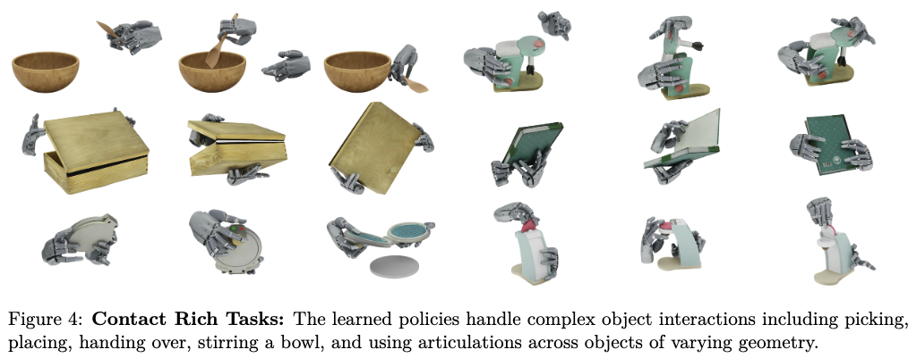
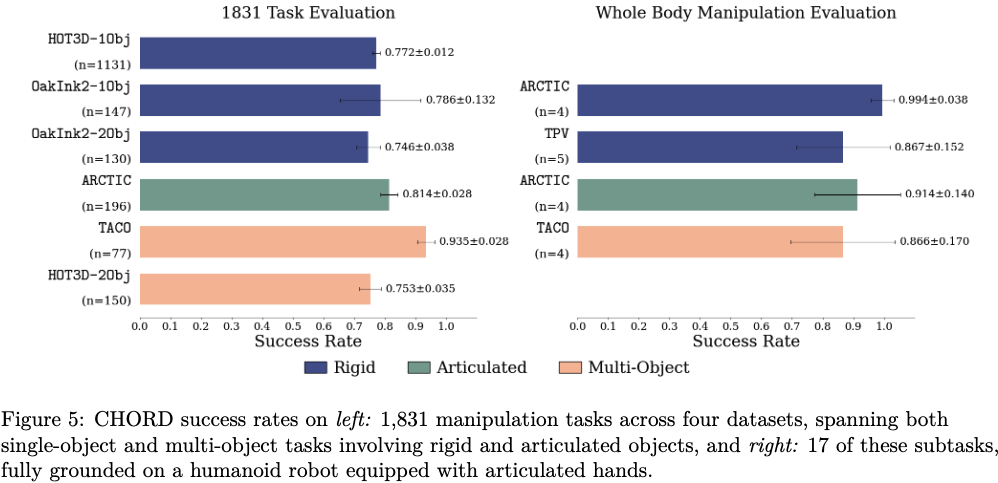
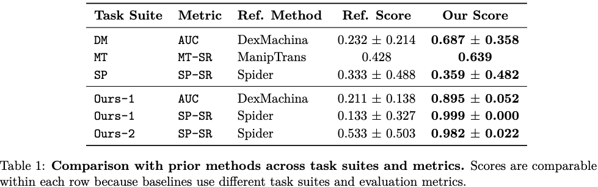
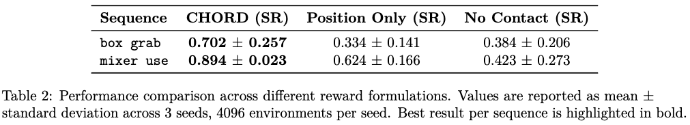
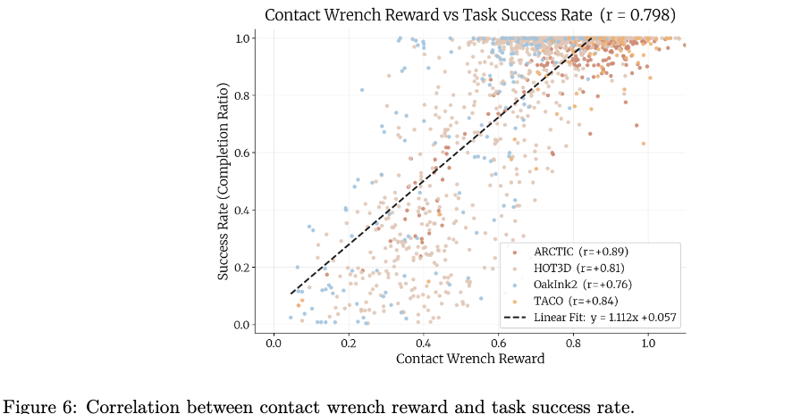
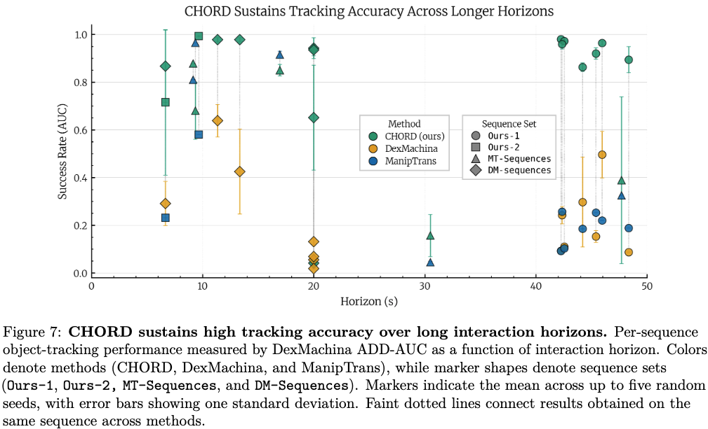
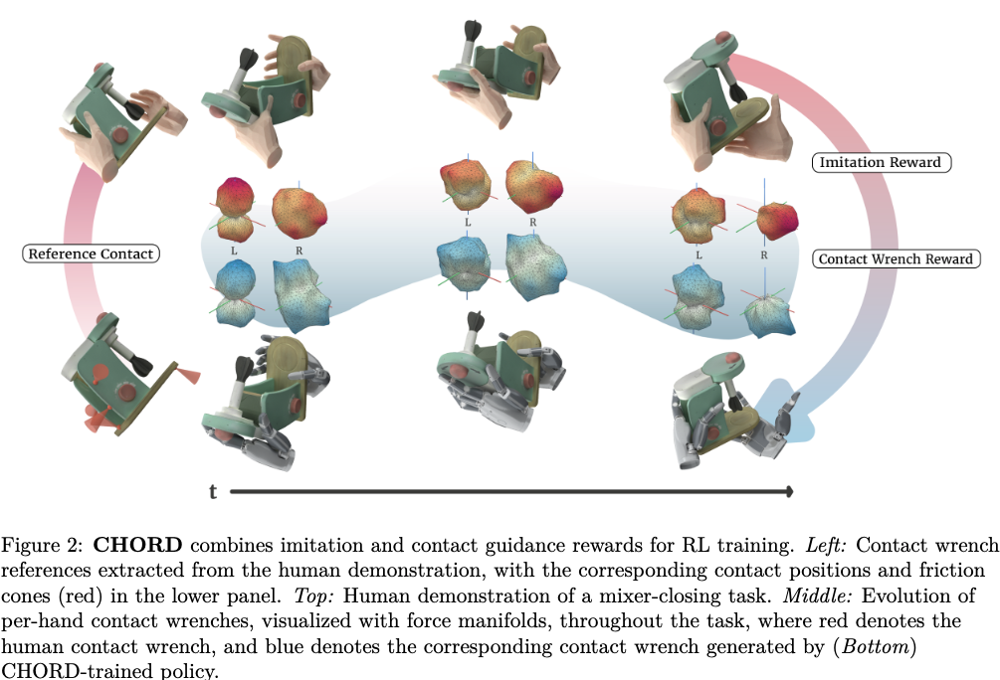

解决的问题：机器人如何从人类演示中学习可迁移且可扩展的任务知识？

贡献包括：
1. 提出 CHORD：一个基于力旋量空间接触引导的框架，能够通过强化学习将人类演示迁移到灵巧机器人策略中；
2. 构建了一个包含 4,739 个长时序双手灵巧操作任务的基准，涵盖刚体、铰接体和多物体交互；
3. 在大规模仿真中验证了 CHORD 的有效性：在 1,831 个任务上达到 82.12% 的成功率，在全身操作任务中达到 90.77% 的成功率，并成功部署到真实机器人硬件上。

# 实验

我们开展实验，以评估 CHORD 在大规模任务上的可扩展性，并将其与基线方法进行比较，见第 4.1 节。随后，我们分析所提出的接触力旋量奖励，展示其相较于已有目标函数的优势，见第 4.2 节；它与操作成功率之间的相关性，见第 4.3 节；以及它在学习长时序灵巧任务中的作用，见第 4.4 节。接下来，我们展示 CHORD 在全身操作任务中的泛化能力，见第 4.5 节；以及在真实世界部署中的表现，见第 4.6 节。最后，我们提供了一项初步研究，将基于强化学习的灵巧操作与遥操作进行比较，见第 4.7 节。

## 大规模任务评估

我们在从第 3.3 节所述基准中采样得到的 1,831 个任务上评估 CHORD，并在所有任务中使用相同的超参数，包括 VOC 增益、课程学习调度以及奖励权重。据我们所知，CHORD 是首个在如此规模上进行评估的基于强化学习的灵巧操作方法。

从定性结果来看，图 4 表明 CHORD 能够解决多种富接触任务，包括单手和双手抓取放置、交接、协同操作、铰接物体操作以及工具使用等。学习得到的行为能够完成任务，同时紧密跟随人类演示。即使仅使用简单的基于关键点的逆运动学方法，CHORD 仍然能够通过力旋量空间引导来避免不匹配的接触效果，从而对重定向噪声以及手—物体穿透保持鲁棒性。更多结果见补充视频和附录。

从定量结果来看，我们将任务完成率作为主要评价指标。如果一次 rollout 能够完成任务，并且没有触发以物体为中心的终止条件，则认为该 rollout 成功。其中，物体中心终止条件定义为位置误差超过 15 cm 或旋转误差超过 40°。随后，完成率被定义为成功 rollout 数量与总 rollout 数量之比；当一个任务的完成率大于 0.7 时，我们认为该任务成功。图 5 左侧显示，CHORD 在 1,831 个任务上表现稳定且强劲，覆盖了多种物体类型和不同任务时长。

我们发现，稳定训练要求接触力旋量奖励先收敛，然后再衰减 VOC。对于接触区域较小或交互过程较精细的困难任务，通常需要更长时间的优化。

## 基线方法比较

我们将 CHORD 与从人类演示中学习的先进灵巧操作方法进行比较，包括 ManipTrans [15]、DexMachina [49] 和 SPIDER [29]。对于每个基线方法，我们都在其原始任务套件上进行评估，并使用其对应的评价指标和 Sharpa hand。由于部分任务存在资产质量问题，无法在 Isaac Lab 中可靠仿真，因此我们排除了这些任务。最终，我们使用 ManipTrans（MT）中的 8 个任务、SPIDER（SP）中的 3 个任务，以及 DexMachina（DM）中的全部 7 个任务来评估我们的方法。

此外，我们还从自己的基准中选择了 9 个任务，覆盖单物体操作任务，即 Ours-1，以及双物体交互任务，即 Ours-2。由于不同基线方法采用的评价指标和评估协议不同，我们按照对应基线的原始指标报告每种方法的结果，包括 DexMachina [49] 中的物体跟踪误差曲线下面积，简称 AUC；SPIDER [29] 中的成功率，记为 SP-SR；以及 ManipTrans [15] 中的成功率，记为 MT-SR。__有关基线方法复现细节，请参见附录 G。__

表 1 显示，CHORD 在基线任务套件和我们自己的任务套件上都取得了较高的成功率，并且在各方法原始评价指标下，始终能够达到或超过当前先进方法的表现。这些结果与图 5 中的大规模评估结果一致，说明 CHORD 同时具备广泛的操作能力，以及完成具体任务所需的精确性。

此外，已有方法通常只局限于刚体物体、铰接物体或多物体操作中的某些子类别，而 CHORD 能够在这三类任务中都取得成功。这种更广泛的覆盖范围，对于构建能够在不同任务类型中保持鲁棒性的操作能力非常重要。更多鲁棒性分析和消融实验见附录 A。

## 4.2 接触力旋量引导分析

我们比较了三种奖励形式，它们所包含的接触引导程度依次降低：

1. **CHORD**：接触力旋量支持奖励；
2. **Position Only**：仅使用接触位置奖励，与 DexMachina 中的设置类似；
3. **No Contact**：不使用接触引导，仅使用任务奖励和模仿奖励。

其中，**Position Only** 用于检验是否有必要引入力旋量层面的接触引导；**No Contact** 则用于检验是否需要任何形式的接触引导。

我们从 ARCTIC [6] 中选择了两个具有代表性的长时序序列，这些序列都涉及铰接物体操作能力，分别是 **box grab** 和 **mixer use**。所有变体都共享相同的非接触奖励项，包括物体姿态跟踪奖励、手部关键点跟踪奖励以及手部关节位置跟踪奖励。不同变体之间唯一的区别在于接触监督的形式。

如表 2 所示，随着引入更加丰富的接触引导，方法性能逐步提升。CHORD 取得了最高性能，表明在接触力旋量空间中监督操作过程是有益的。

当在 **Position Only** 中使用接触位置奖励替代基于力旋量的监督时，性能出现了明显下降。这说明，仅仅匹配接触位置并不足以准确复现富接触操作行为。

最后，**No Contact** 基线整体表现最弱，突出了仅依赖运动学跟踪目标来学习富接触操作任务的局限性。

## 4.3 接触力旋量奖励与任务成功率之间的相关性

为了评估接触力旋量支持奖励，即 Contact-Wrench-Support（CWS）reward，是否能够预测下游任务性能，我们汇总了基准中的 1,831 次运行结果。对于每次运行，我们提取了对应的 CWS 奖励以及任务成功指标，也就是 1,831 个任务上的评估完成率。

在图 6 中，为了使不同数据集之间的数值具有可比性，我们针对每个序列分别对获得的 CWS 奖励进行了归一化处理。这是因为不同数据集在接触密度和轨迹长度上存在差异，直接比较原始奖励数值并不公平。

在所有运行结果中，我们观察到归一化后的 CWS 奖励与任务成功率之间存在很强的正相关关系，Pearson 相关系数约为：

$$
r \approx 0.80
$$

并且这一关系在每个数据集内部都保持一致，相关系数范围为：

$$
r = 0.76 \sim 0.89
$$

这种关系呈现出单调但逐渐饱和的趋势：随着 CWS 奖励增加，任务成功率会快速上升，随后在接近 1 的位置趋于平台。因此，文中使用普通最小二乘直线作为一阶概括来描述整体趋势。该线性模型能够解释约三分之二的方差，但在高奖励区域不可避免地低估了实际拟合效果。

这些结果表明，策略满足接触力旋量支持目标的程度，与其操作成功率之间存在可靠的相关性。这支持了 CWS 奖励作为有效训练信号和代理评价指标的作用。

## 4.4 多样化能力支持长时序操作

接触力旋量作为一种统一抽象，使 CHORD 能够执行多种不同类型的灵巧操作任务。这种多样性是实现长时序任务执行的关键基础：通过使用单一机制组合丰富的操作行为库，CHORD 能够扩展到具有前所未有时间跨度的任务序列。

图 7 展示了使用 DexMachina 中引入的 AUC 指标衡量得到的性能结果。评估序列覆盖了广泛的交互时长范围，从较短的操作片段到持续近一分钟的扩展任务序列不等。

在这一范围内，CHORD 始终取得了较强的性能表现。对于大多数序列，即使在最长时序任务中，大约 40 到 48 秒，CHORD 仍然能够保持接近饱和的跟踪精度：

$$
ADD\text{-}AUC \approx 0.85 - 0.98
$$

相比之下，基线方法会随着交互时长的增加而出现明显的性能下降。

# 方法
本文目标是基于人类示教数据，学习刚性物体与铰接物体的长时序机器人操作策略。

假设场景内包含 $K$ 个刚体，既可以是 $K$ 个独立刚性物体，也可以是由 $K$ 个构件组成的铰接物体。每组示教对应一条参考轨迹 $\tau_\text{ref} = \{x_t^\text{human}, x_t^\text{object}\}_{t=1}^H$，其中 $x_t^\text{human}$ 代表三维人手关键点；$x_t^\text{object} = \{x_{t}^{\text{object},k}\}_{k=1}^K$ 表示各物体构件位姿，$x_{t}^{\text{object},k} \in \text{SE}(3)$（见图2）。
首先求解逆运动学，将人手关键点运动重定向为机器人关节构型 $x_t^\text{robot}$。策略网络 $\pi(a_t \mid o_t^\text{robot}, o_t^\text{object}; x_t^\text{robot}, x_t^\text{object})$ 基于当前机器人观测 $o_t^\text{robot}$、物体观测 $o_t^\text{object}$ 与参考运动 $x_t^\text{robot},x_t^\text{object}$ 输出动作，优化目标为让仿真推演得到的物体位姿序列 $\{s_t^\text{object}\}_{t=1}^H$ 跟踪参考轨迹 $\{x_t^\text{object}\}_{t=1}^H$。

本文提出**基于人类示教的机器人灵巧操作接触力扭矩引导框架（CHORD）**，用于刚性物体、铰接物体及多物体交互场景下长时序、高接触灵巧操作。本章结构安排：3.1节推导强化学习奖励函数；3.2节介绍CHORD如何基于含噪声人类参考轨迹实现高效鲁棒学习，并拓展至全身机器人操作；3.3节介绍本文构建的灵巧操作基准测试集。马尔可夫决策过程（MDP）完整设置详见附录。

## 3.1 基于力扭矩空间接触引导的强化学习
本文采用VOC优化框架[49]训练策略，总奖励由任务跟踪奖励、运动模仿奖励、接触引导奖励三部分相加构成：$r = r_\text{task} + r_\text{imit} + r_\text{contact}$（见图2）。

### （1）任务跟踪奖励 $r_\text{task}$
该奖励约束仿真推演轨迹贴合物体参考运动，同时兼顾各构件自身位姿与构件间相对空间关系：
$$
r_\text{task} = \exp\left(-\frac{\sum_{k=1}^K \|x_{t}^{\text{object},k} \ominus s_{t}^{\text{object},k}\|_2^2}{\text{var}_\text{obj}}\right) + r_\text{relative}
$$
符号 $\ominus$ 代表SE(3)流形上的位姿偏差运算。
对于插入、倾倒、舀取、工具使用等高度依赖物体间几何匹配的多物体交互任务，仅独立跟踪每个构件位姿效果有限，因此引入相对奖励项：
$$
r_\text{relative} = m(t) \exp\left(-\frac{e_\text{object}}{\text{var}_\text{rel}}\right)
$$
其中 $m(t)$ 为开关函数，仅在物体交互阶段激活该项；$e_\text{object}$ 衡量物体间位姿误差。

### （2）运动模仿奖励 $r_\text{imit}$
约束机器人运动贴近经重定向后的人类手部轨迹：
$$
r_\text{imit} = \exp\left(-\frac{\|x_t^\text{robot} - s_t^\text{robot}\|_2^2}{\text{var}_\text{imit}}\right)
$$
$\text{var}_\text{obj},\text{var}_\text{rel},\text{var}_\text{imit}$ 分别为各指数核对应的方差超参数。

如第2节所述，仅基于接触位置设计奖励存在明显缺陷。以右侧开箱任务举例：第一行是人类示教，拇指贴合盖子下侧施力；第二行热力图为仅使用位置型接触奖励得到的引导分值。该奖励下优化出的接触点空间位置虽接近人类示教，但物理作用完全不匹配——接触法向量与示教几乎垂直。
与之对比，第三行热力图为本文提出的力扭矩空间接触奖励，该奖励会优先鼓励能够产生与人类示教一致物体运动趋势的接触方式。

### （3）力扭矩空间接触奖励 $r_\text{cws}$
每个时间步对物体第 $k$ 个刚体构件，从物体坐标系下的参考示教轨迹 $\tau_\text{ref}$ [49]中提取 $c_{h,k}$ 组接触信息：接触点坐标集合 $p_{h,k} = \{p_{i}^{h,k}\}_{i=1}^{c_{h,k}}$、接触法向量集合 $n_{h,k} = \{n_{i}^{h,k}\}_{i=1}^{c_{h,k}}$。
对第 $i$ 个接触点任意可行接触力 $f_{i,j}^{h,k} \in \mathbb{R}^3$，其产生的基础力扭矩（旋量）定义为：
$$
w_{i,j}^{h,k} = \begin{bmatrix} f_{i,j}^{h,k} \\ p_{i}^{h,k} \times f_{i,j}^{h,k} \end{bmatrix}^\top \in \mathbb{R}^6
$$

为完整刻画 $c_{h,k}$ 个接触点可实现的全部接触旋量，采用多面体锥近似每个接触点的库仑摩擦锥，锥体内包含 $d$ 条单位长度棱边力向量。接触点 $i$ 的第 $j$ 条棱边力对应一组基础旋量 $w_{i,j}^{h,k}$。将人手与该构件所有基础旋量拼接，得到旋量矩阵：
$$
\mathcal{W}_{h,k} = \begin{bmatrix}
w_{1,1}^{h,k} & \dots & w_{1,d}^{h,k} & \dots & w_{c_{h,k},1}^{h,k} & \dots & w_{c_{h,k},d}^{h,k}
\end{bmatrix} \in \mathbb{R}^{6 \times (c_{h,k}d)} \tag{1}
$$

旋量矩阵 $\mathcal{W}_{h,k}$ 表征人类示教手部接触可作用于构件 $k$ 的全部力-力矩方向，完整刻画接触驱动物体运动的能力。但直接对比人、机器人两类旋量矩阵存在难点：二者列数可能不同，且矩阵内基础旋量排列顺序无固定对应关系。
本文引入支撑函数，通过旋量空间几何特征实现二者对比。预先采样 $b$ 组六维单位方向向量构成矩阵 $\mathcal{B} \in \mathbb{R}^{6 \times b}$，定义人类旋量矩阵的支撑函数：
$$
\sigma_{h,k} = \mathop{\text{max}}_{\text{col}} \left( \mathcal{B}^\top \mathcal{W}_{h,k} \right) \in \mathbb{R}^b \tag{2}
$$
$\mathcal{B}^\top \mathcal{W}_{h,k} \in \mathbb{R}^{b \times (d c_{h,k})}$，对矩阵每一列独立取最大值得到支撑向量 $\sigma_{h,k}$。机器人侧旋量矩阵采用完全相同流程计算得到 $\sigma_{r,k}$。

引入相对容忍系数 $\beta$，对比机器人支撑函数 $\sigma_{r,k}$ 与人类参考支撑函数 $\sigma_{h,k}$，为每个构件 $k$ 定义力扭矩空间奖励：
$$
r_k^\text{cws} = \exp\left(
-\frac{\big\| \max\big(0,\,(1-\beta)\sigma_{h,k} - \sigma_{r,k}\big) \big\|_2^2}{v_\text{cws}}
-\frac{\big\| \max\big(0,\,\sigma_{r,k} - (1+\beta)\sigma_{h,k}\big) \big\|_2^2}{v_\text{cws}}
\right) \tag{3}
$$

训练时以重定向后的人类运动为先验[15]，并采用课程学习策略逐步调整VOC框架权重[49]。

若示教由RGB视频重建得到，手物配准误差会导致接触估计噪声较大，直接匹配人示教旋量会不稳定。该场景下切换为简化版接触旋量引导目标，仅奖励机器人在各旋量基方向生成有效正向支撑：
$$
r_k^\text{fc} = \frac{1}{B}\sum_{b=1}^B \mathbb{1}[\sigma_{r,k,b} > \epsilon]
$$
$\sigma_{r,k,b}$ 代表构件 $k$ 在第 $b$ 组基方向上的机器人支撑值，$\epsilon$ 为极小阈值；最大化该项等价于满足力封闭条件。

### 拓展至全身机器人操作
CHORD可基于纯手部示教或全身示教，自然拓展至全身操作任务：
1. **纯手部示教**（如第一人称视角重建示教）：训练图像补全模块[42]，从末端执行器轨迹预测完整全身运动，随后使用上述带旋量空间奖励的强化学习框架训练；
2. **全身示教**（如第三人称重建示教）：虽可获得全身运动，但手指重建精度通常较差，手物交互噪声严重[45]，因此训练时采用简化力封闭目标 $r_k^\text{fc}$。
更多细节见附录E。

## 3.3 基于人类示教的灵巧操作基准数据集
为支撑示教学习领域研究、实现更大规模算法评测，本文整合处理现有主流人体操作公开数据集[2,4,6,14,20,39,48]，导入Isaac Lab仿真平台用于策略训练[25]。
最终整理得到4739个可仿真、可训练的开源任务环境；同时依托自研视频，通过手物重建与跟踪算法补充生成额外示教样本。
整套基准集覆盖单/多刚性物体、铰接物体的双手协同操作场景（见图1）。

本文从三大核心指标与现有工作[15,29,49]对比任务丰富度：时序长度、单任务接触事件数量、基于Ferrari-Canny ε指标衡量的抓取稳定性。如图3所示，本文数据集包含更多任务、更长操作时序、更密集的接触交互。
这类任务无法依靠简单抓取完成，必须设计精细接触策略，并双手协同配合才能成功。
指标定义、视频重建流程、后处理完整步骤详见附录D。