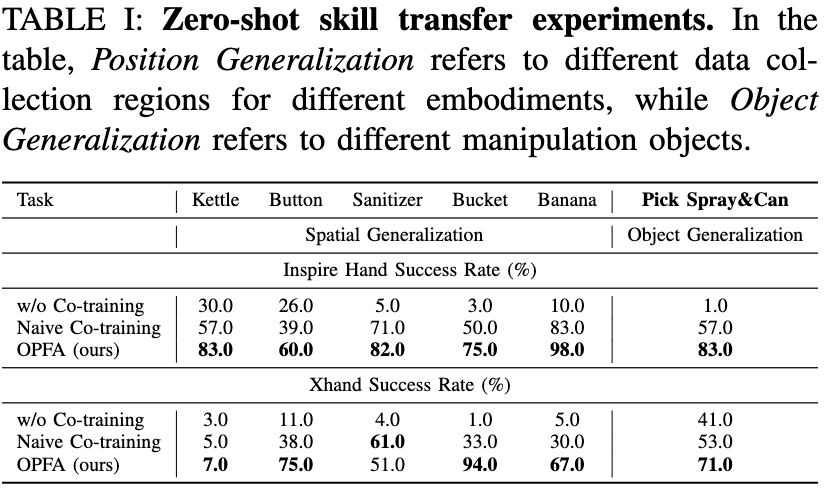
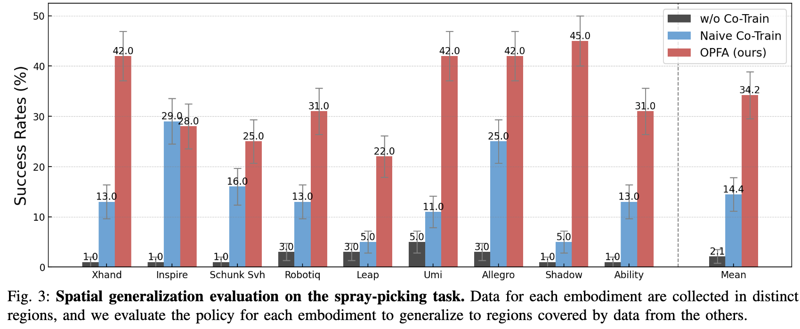
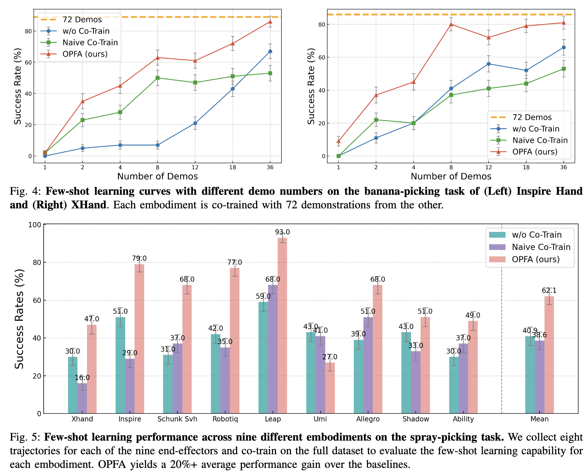
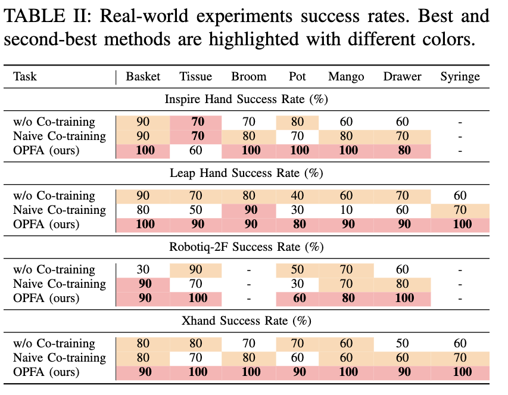
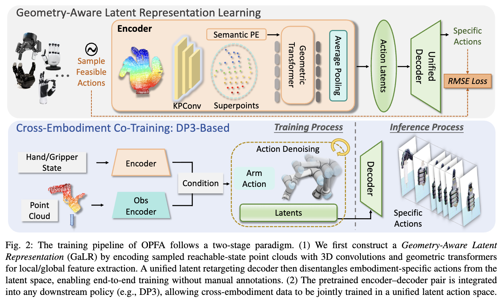

解决的问题：
1. 不同机器人本体间存在巨大差异: 动作空间不统一、机械结构截然不同等问题，给多源数据集联合训练带来极大挑战

已有的工作和问题：
Bauer 等人 [13] 基于 MANO 人手模型 [36] 对齐隐特征，在共享隐动作空间中训练扩散策略；VideoDex [37] 直接从人类操作视频中提取动作；CrossDex [38] 依托 MANO 人手模型构建抽象动作空间并学习通用策略，再将抽象动作重定向转换为机器人专属控制指令。
但各类末端执行器机械结构差异极大，简单粗暴地将机器人手对齐至人手模型容易引发动作冲突。

本文方法：使用一套统一策略对多本体数据无冲突联合训练，即可有效缓解数据稀缺问题。此外，将策略学习与特定末端执行器解耦，能够得到泛化性更强、适配范围更广的通用策略，同时提升数据利用效率，大幅推动算法在真实场景落地部署。本文提出的 OPFA 框架不再依赖预先定义的人手先验，而是基于所有末端执行器采样得到的可达状态点云，自主学习几何感知隐表征，从根源规避动作冲突；同时采用统一隐空间重定向解码器，无需针对任意机械手单独调优解码器参数。

三大核心贡献如下：
1. 构建几何感知隐表征 GaLR，统一不同末端执行器的动作空间维度，自动学习几何结构信息，无人工标注成本；
2. 提出端到端跨本体联合训练方案，无需针对任意硬件本体单独调优解码器；
3. 在仿真与真实机器人平台完成大规模实验，覆盖 11 种末端执行器；多组跨本体对比实验证明，相较于单本体自训练、简易多本体联合训练方法，OPFA 性能提升显著。

# 实验
研究跨本体机器人操作任务时，我们主要有两大研究目标：第一，经多本体联合训练后，单一机械手能够泛化至其他参与联合训练设备数据所覆盖的作业空间；第二，面对全新机械手本体时，可借助已有的跨本体数据实现少样本学习。基于上述目标，本章设计完备实验，验证 OPFA 框架具备这两项核心能力。
## A. 实验实现细节
机械手本体
本实验共采用 11 种不同末端执行器。真实机器人平台使用 XHand [21]、带触觉传感的 Inspire 灵巧手 [20]、Robotiq-2F-85 二指夹爪、Leap Hand [19]；仿真环境额外补充 UMI 夹爪 [18]、Robotiq-3F 三指夹爪、Allegro 手、Shadow 手、Ability 手、Schunk SVH 手，以及无触觉版本 Inspire 灵巧手。所有机械手共用同一套编码器、解码器与统一隐动作空间。
### 操作任务
仿真环境下设置 7 项测试任务，包含拉水壶、按按钮、提桶、抓取放置等；真实机器人平台同样开展 7 项实操实验。
### 对比基线
为量化 OPFA 的跨本体适配性能，设置两组基线算法：
单本体训练基线（w/o Co-Train）：仅使用待测机械手自身数据集训练，不引入其他设备数据联合训练；
简易多解码器联合训练基线（Naive Co-Train）：当前绝大多数现有方法采用该方案，为每种机械手单独分配独立解码器，再执行跨本体联合训练。
## B. 跨本体泛化能力验证
本小节旨在验证：多本体联合训练完成后，任意一款机械手都能泛化至其他设备数据覆盖的空间范围，或是迁移掌握同类操作技能。为此设计两类评测方案：空间泛化测试、跨物体技能迁移测试。
### 1）空间泛化实验设置

通过遥操作为每种机械手采集 72 条示教轨迹，且不同机械手的训练数据取自互不重叠的作业空间区域。随后融合多设备数据开展联合训练，并将每款机械手置于其他机械手的数据分布区域内完成测试。表 1 展示 Inspire 灵巧手 [20] 与 XHand [21] 在该实验下的测试结果。
对每款机械手而言，测试空间均为训练阶段完全未见过的区域。仅使用单本体数据训练的基线几乎全部任务失败，两款机械手在五项任务中的位置泛化效果极差。
简易跨本体联合训练基线可一定程度缓解该问题 —— 多设备数据共同训练能学习到更通用的腕部运动先验知识。但受本体鸿沟限制，精细的末端空间特征难以完成迁移；且独立专属解码器架构会直接丢失这类细粒度几何信息。
与之相比，OPFA 在共享几何感知隐动作空间内完成多机械手联合训练，可同时复用腕部运动信息与末端执行器几何特征。即便面对完全陌生的测试空间，OPFA 仍具备优异泛化能力，在全部任务中均表现稳定的跨本体空间迁移效果，提桶、抓取香蕉等任务成功率可达 90% 以上。
### 2）跨物体技能迁移实验
进一步开展难度更高的跨物体技能迁移对比。实验设定：采集 Inspire 手抓取金属罐、XHand 手抓取喷雾瓶的两组数据集，融合后联合训练，再测试模型跨物体泛化性能。如表 1 所示，OPFA 性能大幅优于两组基线；相较于简易多解码器联合训练，Inspire 手任务成功率提升 26%，XHand 手提升 18%。
多机械手拓展实验
为验证 GaLR 表征模块的通用适配性，选取 9 款末端执行器完成喷雾瓶抓取任务的跨本体联合训练。测试空间划分为 9 个子区域，每款机械手仅在其中一个子区域采集训练数据。如图 3 所示，该高难度实验条件下，单本体训练基线全部失效；而 OPFA 显著提升所有机械手的任务成功率，相比简易多解码器联合训练方法，平均成功率提升 19.8%。

## C 少样本学习能力
OPFA 的另一项关键能力是小样本学习，即当引入一种新的末端执行器时，仅利用少量数据就能够达到接近单一来源大规模数据训练的性能。为评估这一能力，我们在香蕉采摘任务上开展实验，分别为 Inspire Hand 和 XHand 各采集了 72 条轨迹。随后，从这些轨迹中采样不同规模的子集，用于小样本学习测试。

### 实验方案：

对于 Inspire Hand，我们分别采样 1、2、4、8、12、18 和 36 条轨迹，并与 XHand 的全部 72 条轨迹进行联合训练；反之，也对 XHand 进行同样设置。相应的小样本学习曲线如图 4 所示。
随着采样轨迹数量的增加，OPFA 的性能快速提升：仅使用 8 条轨迹时，Inspire Hand 就已经取得了较高的成功率，而 XHand 的成功率超过 80%，接近完整训练模型的性能，并显著优于基线方法。相比之下，朴素联合训练会随着样本数量增加而出现训练抑制现象，有时甚至表现得比不进行联合训练的基线方法更差。这些结果表明，OPFA 具有很强的小样本学习能力。
### 更多本体实验
如图 4 所示，OPFA 显著增强了跨本体小样本学习能力，仅使用 8 条新采集轨迹就能够达到具有竞争力的成功率。为了进一步验证 OPFA 在更广泛末端执行器上的小样本能力，我们将本体数量扩展到 9 种。在喷雾瓶抓取任务中，每种本体仅采集 8 条轨迹，并将总共 72 条轨迹用于联合训练。结果如图 5 所示。当本体数量较多时，由于不同夹爪和灵巧手之间存在显著的几何差异，朴素联合训练方法可能会产生冲突，在某些情况下甚至低于不进行联合训练的基线方法。
相比之下，OPFA 通过几何感知的联合训练，有效整合了不同本体之间的信息，从而带来了显著的准确率提升。例如，在 Leap Hand 上取得了 93% 的成功率，并达到 62.1% 的平均成功率，相比朴素联合训练方法提升超过 20%。
## D 实物平台真实场景实验
### 实验平台搭建
我们的真实世界实验平台由 UR5e 机械臂和 Microsoft Azure Kinect 深度相机组成（见图 7），并配备了四种不同的末端执行器：XHand、Inspire Hand、Leap Hand 和 Robotiq-2F 夹爪。我们设计了七个操作任务，涉及不同物体和目标：Basket，将篮子抓取并放置到指定位置；Tissue，从纸巾盒中抽出纸巾；Broom，用扫帚将物体扫入簸箕；Pot，抓取壶并向杯中倒水；Mango，将芒果抓取并放到盘子上；Drawer，将积木放入抽屉并关闭抽屉；Syringe，将注射器移动到杯子上方并按下注射器推杆。

对于每种本体和每个任务，我们通过 Spacemouse [41] 和外骨骼设备 [42] 进行遥操作，采集了 24 条演示数据。在评估阶段，一个统一的策略检查点会在所有本体上进行测试，每个任务测试 10 次。由于形态结构限制，某些本体无法执行特定任务，因此被排除在相应任务之外。例如，Robotiq-2F 被排除在 Syringe 和 Pot 任务之外，Inspire Hand 被排除在 Syringe 任务之外。

### 实验结果分析
表 II 总结了真实世界实验的定量结果。我们的方法在大多数评估任务和本体上都表现出持续较高的成功率，验证了其学习通用且可泛化操作策略的能力。特别是在 Drawer 这类具有挑战性的长时序任务，以及 Pot 这类需要精细控制的任务中，不进行联合训练的方法只能从单一本体数据中学习概念性知识。当物体位置变化较大时，这类方法会产生较大的操作误差。

朴素联合训练在一定程度上提升了长时序任务的性能，但在 Pot 任务中，不同末端执行器之间显著的结构差异会导致动作冲突，使其表现甚至低于不进行联合训练的方法。相比之下，OPFA 能够在不同本体之间共享腕部轨迹层面的任务概念和细粒度动作知识，因此在各项任务中持续优于基线方法。通过在不同末端执行器之间共享几何知识，OPFA 实现了本体专用动作头难以达到的性能水平，尤其是在数据高效学习场景下表现更加突出。

此外，OPFA 的技能迁移能力不依赖于具体任务类型：它既能够泛化到可变形物体任务，例如 Tissue，也能够泛化到刚性物体任务，例如 Broom；既能够处理 pick-and-place 类任务，例如 Mango，也能够处理灵巧操作任务，例如 Syringe

---
# 方法
本文提出**单策略适配全设备（OPFA）** 这一面向跨执行器灵巧操作的通用框架。OPFA 采用两阶段训练范式：
（1）无标注学习阶段：学习几何感知隐表征（GaLR），统一各类末端执行器的动作空间；
（2）策略融合阶段：将 GaLR 嵌入策略（如 DP3 [17]）的状态条件分支与动作预测头，实现端到端跨设备联合训练。完整算法流程如图 2 所示。

## A 整体问题定义
记所有执行器设备集合为 $\mathcal{M}= \{1,2,...,M\}$，每台设备 $m \in \mathcal{M}$ 对应数据集 $\mathcal{D}_m = \{\tau_{mi}\}_{i=1}^{N_m}$，由多条示教轨迹构成。
单条轨迹定义为 $\tau_{mi} = \{(o_{mt}, a_{mt})\}_{t=1}^{T_{mi}}$，其中 $o_{mt}$ 代表 $t$ 时刻观测，$a_{mt} \in \mathbb{R}^{d_m}$ 为对应动作，$T_{mi}$ 为轨迹长度。

我们的目标是联合训练多设备数据集 $\{\mathcal{D}_m\}_{m=1}^M$，充分复用多设备数据。但不同设备动作维度 $d_m$ 互不相同，**动作空间统一**是核心难点。
现有相关工作 [13][39] 通常为每种设备设计独立 Transformer 输出头或动作解码器。但设备 $m$ 专属解码器仅能使用 $\mathcal{D}_m$ 数据训练，该缺陷在少样本场景下尤为突出：数据稀缺会造成解码器过拟合，严重阻碍跨设备技能迁移（详见 IV-C 节）。

## B 几何感知隐表征 GaLR 学习
GaLR 采用端到端编码器-解码器训练架构，全部训练数据自动生成，无需人工标注。
对任意设备 $m \in \mathcal{M}$：
1. 采样一组可达机械关节状态集合 $\mathcal{J}_m$；
2. 通过正运动学函数 $f_m^\text{FK}$ 与点云采样生成训练样本集 $\{(a_m,P)\}_m$。
其中监督信号 $a_m \in \mathcal{J}_m$ 为关节角度，$P \in \mathbb{R}^{|P| \times 3}$ 为采样得到的手部点云。

采用视觉编码器 $f_\theta$ 提取跨设备、跨姿态共享几何特征，将点云 $P$ 映射至统一隐空间：
$$z = f_\theta(P) \in \mathbb{R}^{d_\text{latent}}$$
再通过共享全局解码器 $g_\psi$，从隐向量预测对应设备关节角度 $\hat{a}_m$：
$$\hat{a}_m = g_\psi(z)$$

原始稠密点云点数庞大，直接提取特征会产生大量冗余、拖慢计算。为此设计**三级下采样**获取多尺度空间特征：
- 原始稠密点云：$P \in \mathbb{R}^{|P| \times 3}$
- 一级下采样点云：$\tilde{P} \in \mathbb{R}^{|\tilde{P}| \times 3}$
- 最终超点集：$\hat{P} \in \mathbb{R}^{|\hat{P}| \times 3}$
满足点数关系 $|\hat{P}| < |\tilde{P}| < |P|$。
在超点 $\hat{P}$ 层级引入几何 Transformer [15]，捕捉全局手部姿态表征。

### 多尺度局部结构编码
基于下采样点云，使用 3D 卷积 [14] 完成多尺度特征提取。
定义半径 $r$ 的三维球体邻域：$\mathcal{B}_3^r = \{y \in \mathbb{R}^3 \mid \|y\| \le r\}$。
以查询点 $x$ 为中心，邻域点 $x_i$ 的相对坐标 $y_i = x_i - x \in \mathcal{B}_3^r$。
核点集合 $\{\tilde{x}_k \mid k < K\} \subset \mathcal{B}_3^r$，每个核点对应权重矩阵 $W_k \in \mathbb{R}^{D_\text{in} \times D_\text{out}}$；$K$ 为核点数量，$D_\text{in}/D_\text{out}$ 分别为输入、输出特征维度。

对查询点 $x$，其邻域点输入特征为 $f_{x_i} \in \mathbb{R}^{D_\text{in}}$，卷积输出为：
$$
g(x) = \sum_{i}\sum_{k<K} h(y_i, \tilde{x}_k) W_k f_{x_i} \tag{1}
$$
$h$ 用于衡量相对坐标 $y_i$ 与核点 $\tilde{x}_k$ 的距离相似度，采用截断线性衰减函数：
$$
h(y_i, \tilde{x}_k) = \max\left(0,\ 1 - \frac{\|y_i - \tilde{x}_k\|}{\sigma}\right) \tag{2}
$$
$\sigma$ 为超参数，控制单个核点的特征影响半径。

### 全局手部姿态感知
3D 卷积提取末端执行器多尺度局部几何特征，并压缩至超点集合。
为建模设备全局姿态信息，在超点上使用几何 Transformer [15] 执行交叉注意力计算。
直接对超点做注意力易出现位置歧义，本文引入两类位置嵌入解决该问题：
1. 基础坐标位置嵌入 $r_p$；
2. 自研语义位置嵌入 $r_s$：提供跨设备统一结构编码，融合空间语义保留精细位置信息，实现设备无关几何推理。

具体实现：
为每个超点 $p \in \hat{P}$ 分配二维语义索引 $\pi(p) = (u_p, v_p)$：
- $u_p \in \{0,...,5\}$：手指层级索引（0=手掌、1=拇指、2=食指…5=小指）；
- $v_p \in \mathbb{Z}_{\ge0}$：单根手指分段层级索引，每根手指分段从 0 开始计数。

构造二维索引向量 $\boldsymbol{s}_p = [u_p, v_p]^\top \in \mathbb{R}^2$，投影至特征空间得到语义嵌入：
$$r_s = \boldsymbol{s}_p W_S \in \mathbb{R}^{d_t}$$
$d_t$ 为超点特征维度，$W_S \in \mathbb{R}^{2 \times d_t}$ 为语义投影矩阵。

将两类位置嵌入相加后送入几何 Transformer：
$$
\tilde{f}_p = \text{Transformer}(f_p,\ r_p + r_s),\quad p \in \hat{P} \tag{3}
$$

最后对优化后的超点特征 $\{\tilde{f}_p\}_{p\in\hat{P}}$ 全局平均池化，得到最终几何感知隐表征 GaLR：
$$
z = \frac{1}{|\hat{P}|}\sum_{p\in\hat{P}} \tilde{f}_p \tag{4}
$$

### 带隐空间重定向的统一解码器
GaLR 作为统一隐动作表征抹平了不同设备动作维度差异，但推理阶段仍需还原真实机械关节角度。
现有方案 [13] 为每台设备独立训练动作解码器，各解码器仅能使用自身数据集，无法共享全局信息；少样本场景极易发生过拟合（详见 IV-C）。

本文设计全局共享解码器 $g_\psi$：基于虚拟通用手部模型 $H$ 预测全部物理有效关节 $\hat{\Theta}$，通用模型囊括所有测试灵巧手/夹爪存在的全部关节（如拇指偏航、拇指基底弯曲、食指偏航等）。
对某一特定灵巧手 $m$，仅从通用关节集合中筛选该设备真实存在的关节，记为 $\hat{\Theta}_m$。
计算预测关节 $\hat{\Theta}_m$ 与真实关节 $a_m$ 的均方根误差（RMSE）损失，即可端到端优化整套 GaLR 训练流程。

## C 跨设备策略联合训练
借助 GaLR 统一隐动作表征，不同末端执行器可共用一套训练、推理流程。
给定多设备混合数据集 $\{\mathcal{D}_m\}_{m=1}^M$，目标学习统一视觉运动策略 $\pi: \mathcal{O} \to \mathcal{A}$，实现从任意设备视觉观测 $o \in \mathcal{O}$ 到标准隐动作空间 $\mathcal{A}$ 的映射。

定义由手部真实关节生成 GaLR 的复合函数：
$$
G = f_\theta \circ f_m^\text{FK} \tag{5}
$$
对设备 $m \in \mathcal{M}$，设备专属隐空间策略为：
$$
\pi_m: o_{mt} \mapsto G(a_{mt}) \in \mathbb{R}^{d_\text{latent}} \tag{6}
$$

通过 GaLR，全局策略 $\pi$ 从全部设备混合数据集中学习与设备无关的视觉运动技能。
OPFA 不绑定特定底层策略框架，可无缝对接 ACT [40]、DP3 [17] 等主流算法，仅需两处小幅修改：
1. 将原动作预测分支改为预测 GaLR 隐表征；
2. 观测内状态项 $s_{mt}$ 替换为对应手部 GaLR 表征 $G(s_{mt})$。
本文实验选用 DP3 作为底层策略主干网络。

训练阶段在隐空间对 GaLR 执行去噪处理；推理时直接使用多设备混合数据集训练完成的 DP3 模型预测 GaLR，再调用预训练统一解码器还原对应设备真实关节角度 $\hat{\Theta}_m$。